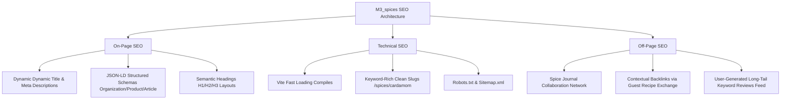

# Student Summary Report: "M3_spices" E-Commerce & Advanced SEO Strategy

## 1. Executive Objective & Brand Narrative

**M3_spices** (operating under *Veda Spice Co.*) is an artisanal direct-to-consumer e-commerce brand designed to bridge the gap between smallholder Indian spice micro-lots and global culinary spaces. 

### Core Brand Values:
*   **Ethical Sourcing**: Sourced directly from cooperative farming communities in Wayanad, Idukki, and Kashmir, bypassing broker markups and aggregate warehouse delays.
*   **Farm-to-Table Potency**: Spices are harvested at peak volatile oil maturity, cured immediately, stone-ground bi-weekly in cold mills, and packaged in UV-protective glass jars to retain flavor.
*   **Botanical Integrity**: Focuses on natural canopy polyculture cultivation, avoiding chemical fumigation and post-harvest sulfur processing.

---

## 2. Target Audience Profiling

The brand targets premium markets (home cooks, gourmet chefs, and wellness lovers) using tailored product selections:

*   **Gourmet Home Cooks**: Seeking pure daily cooking ingredients (e.g., *M3 Organic Garam Masala*, *M3 Kashmiri Chili Powder*) with rich, authentic taste yields.
*   **Professional Chefs & Bakers**: Demanding extra-high aromatic compound density. Addressed with *M3 Premium Green Cardamom (Export Grade)* and *M3 Kashmir Mongra Saffron threads*.
*   **Health-Conscious Wellness Consumers**: Focused on bioavailability, active curcumin thresholds, and pesticide-free certifications. Addressed with *M3 Lakadong Turmeric* (featuring high 7-12% curcumin levels).

---

## 3. Advanced Dynamic E-commerce & Design Features

### A. Nature-Oriented Branding & Aesthetic
The styling implements a deep nature-focused color palette, integrating rich forest greens, sage green accents, earthy terracotta highlights, and clean crisp cream backgrounds to create an organic, premium visual experience.

### B. Live Commodity Auction Prices Ticker
A live pricing data feed ticker is placed near the top of the homepage. Controlled by a React `useEffect` interval hook, the ticker simulated real-time daily auction pricing fluctuations in Rupees (₹) for four core spices (Saffron, Cardamom, Pepper, Cloves). This feed establishes consumer transparency and replicates high-fidelity agricultural trade environments.

### C. Dynamic Grade Pricing Selector
Every spice details card contains an interactive quality grade selector (Grade A: Supreme Jumbo, Grade B: Bold Premium, Grade C: Standard Split). When selected:
*   Pricing updates dynamically to reflect the current market value in Rupees (₹).
*   Grade details are bound to the product object state, allowing users to add specific grades as separate line items inside their Shopping Cart.

---

## 4. White-Hat SEO Strategy

M3_spices implements structured white-hat optimization compliance to rank organically:

### A. On-Page SEO Implementation
*   **Keyword Integration**: Primary keywords (*"organic artisanal spices"*, *"buy pure Indian spices online"*) and secondary keywords (*"hand-ground masala blends"*, *"single-origin cardamom"*) are incorporated naturally into titles, headings, and descriptions.
*   **Dynamic Title & Meta Tag Injections**: Managed via page router `useEffect` hooks inside [App.jsx](file:///c:/Users/govin/Pictures/OneDrive/Documents/sem7/midhun/src/App.jsx) to serve page-specific headers dynamically.
*   **Heading Structure**: Proper hierarchy: H1 for main page headers, H2 for major sub-sections (e.g. Sourcing story, Reviews), and H3 for card titles.
*   **JSON-LD Structured Schemas**: Pre-packaged snippets for Store organization on Home, Product detail specifications (rating, price range, stock) on spice details views, and Article details on blog posts.

### B. Technical SEO
*   **Performance Optimization**: Single-Page App (SPA) compilation via Vite + Tailwind CSS v4 delivers light bundle weights (<350kB), fast loading times, and zero server roundtrips.
*   **Slugs**: Clean directory structures (e.g., `/shop/m3-premium-cardamom`, `/journal/ethical-sourcing-story`).
*   **Crawling maps**: XML sitemap (`sitemap.xml`) indexing active URLs and `robots.txt` budgeting crawler paths.

### C. Off-Page SEO & Social Proof
*   **Built-in Spice Journal (Blog)**: Authoritative culinary guides (e.g. oil-blooming tempering) serve as linkable assets.
*   **Guest Blogging Collaborations**: Direct outreach widgets invite culinary writers to co-author articles, generating fair, reciprocal backlink exchanges.
*   **Active Review Feeds**: User comment forms submit review logs directly to product pages, producing fresh long-tail search keywords.
